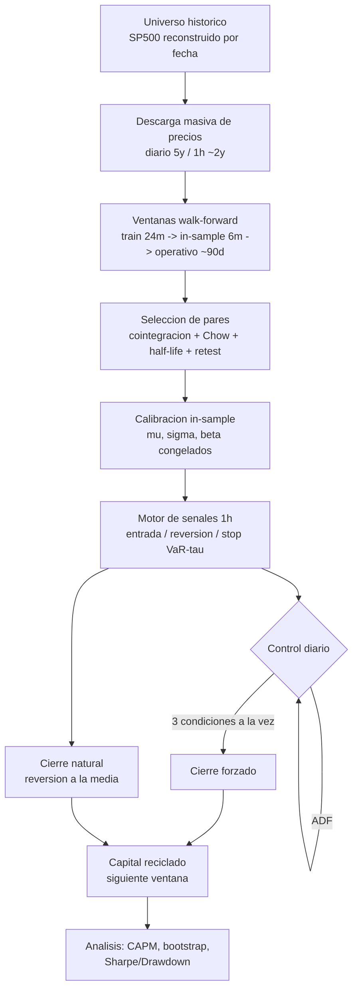
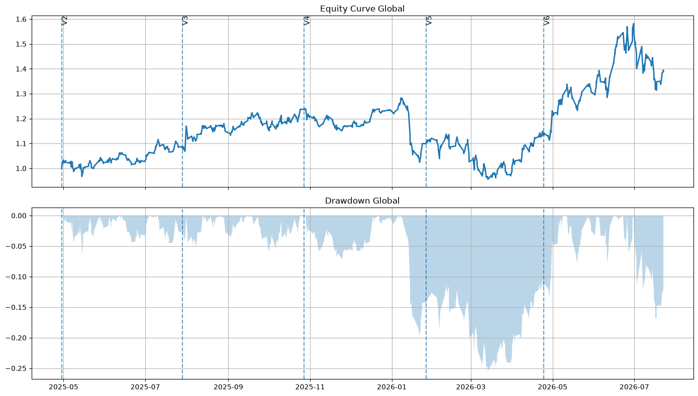
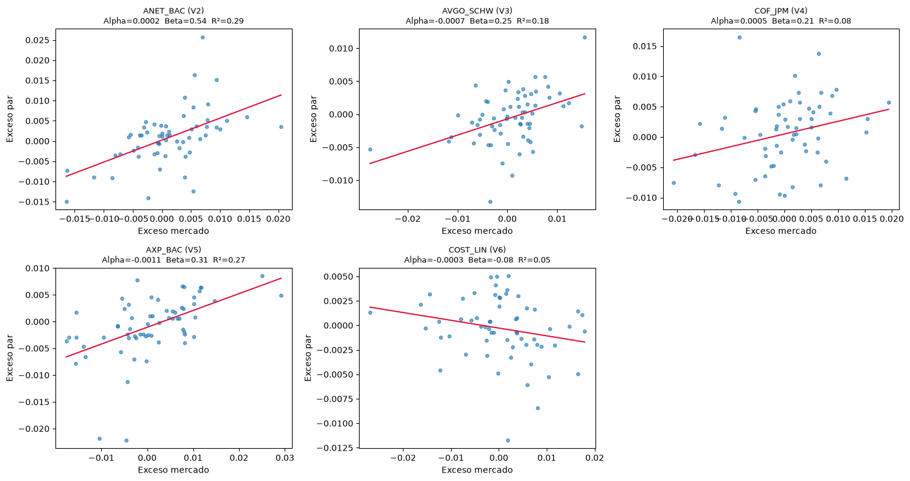
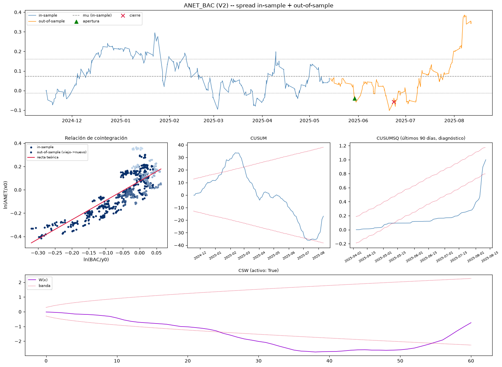

# Pair Trading — backtest walk-forward con control diario de riesgo

Backtest de una estrategia de statistical arbitrage (pair trading
basado en cointegración, no en distancia de precios) con un sistema
de control de riesgo diario de 3 capas, corrido en modo walk-forward
con capital reciclado — es decir, simulando cómo se operaría de
verdad, no un backtest de una sola pasada.

Metodología completa y guía de interpretación de resultados: [documentacion_backtest.pdf](./documentacion_backtest.pdf)

Notebook ejecutable de punta a punta: [ejecutar_backtest_sin_db.ipynb](./ejecutar_backtest_sin_db.ipynb)

---

## Qué hace

1. Reconstruye qué tickers estaban realmente en el S&P 500 en cada
   fecha pasada (no la lista de hoy aplicada a todo el histórico —
   un error común de sesgo de supervivencia).
2. Descarga precios directo de Yahoo Finance (sin base de datos
   local) y selecciona pares por cointegración, con 4 filtros de
   validación en cascada (retest fuera de muestra, estabilidad del
   beta, test de Chow, half-life).
3. Corre la estrategia con capital reciclado ventana a ventana (el
   capital de cada período es el resultado del anterior, no un monto
   fijo repetido).
4. Cada día, mientras una posición está abierta, evalúa 3 controles
   de riesgo independientes (CUSUM, Chu-Stinchcombe-White, ADF) que
   pueden forzar el cierre — sin mirar al futuro en ningún punto.
5. Analiza el resultado con CAPM, bootstrap y Sharpe/Drawdown
   

## Por qué es interesante

- Walk-forward real, no solo un backtest de una pasada: ventanas
  secuenciales sin solape en el tramo operativo, capital reciclado,
  universo histórico reconstruido por ventana.
- El control de riesgo es un hallazgo, no un supuesto: al comparar
  la estrategia con y sin cada capa de control (mismos datos, misma
  selección), se encontró evidencia de que uno de los controles
  (CUSUM) queda estructuralmente ciego a un modo de falla específico
  — deterioro gradual de la relación entre los activos — por una
  razón estadística identificable, no por casualidad. 
- Las limitaciones están documentadas a propósito, no escondidas: el
  límite real de datos intradía disponibles, el sesgo de
  supervivencia que queda parcialmente resuelto, el tamaño de
  muestra de cada análisis estadístico.

## Cómo funciona (flujo)

## Resultados principales

| Métrica | Valor |
|---|---|
| Ventanas operativas | `[5]` |
| Capital inicial | `[$ 1350]` |
| Capital final | `[$2,233.57]` |
| Retorno total | `[65.45%]` |
| Max Drawdown | `[25%]` |
| Beta de mercado (CAPM consolidado) | `[1.29]` |
| IC 95% del bootstrap (PNL) | `[-315.5189, 2090.9659]` |

## Gráficos

| | |
|---|---|
|  |  |
| Equity curve + drawdown, todo el backtest | Beta de mercado por ventana |

Spread in-sample + out-of-sample, relación de cointegración y estabilidad (CUSUM/CSW/CUSUMSQ) de un par de ejemplo.

## Limitaciones conocidas (declaradas, no escondidas)

- Los precios se descargan en bloque para la lista de tickers de
  hoy — un ticker que salió del índice en el pasado no tiene datos
  descargados, aunque el universo histórico reconstruido sí lo
  incluya para esa ventana.
- El histórico de 1h de Yahoo Finance está limitado a ~730 días
  desde la fecha en que se corre el backtest, sin importar qué rango
  se pida.
- Con pocas ventanas operativas, los análisis estadísticos (Sharpe,
  bootstrap, Rank IC) tienen muestra chica — se documentan como
  primera lectura, no como conclusión definitiva.

Detalle completo de cada limitación en [documentacion_backtest.pdf](documentacion_backtest.pdf).
